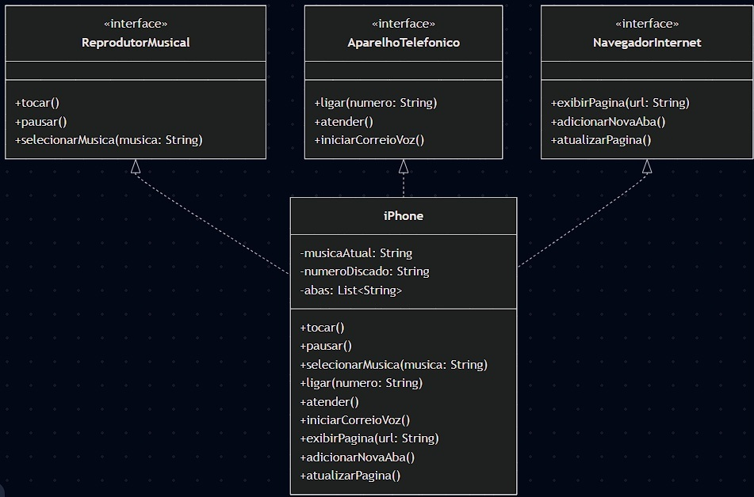

# Projeto iPhone UML to Code

Este projeto é uma representação em código Java de um diagrama UML que modela as funcionalidades básicas de um iPhone, incluindo suas capacidades como Reprodutor Musical, Aparelho Telefônico e Navegador de Internet.

## Diagrama UML



O diagrama UML foi elaborado considerando três interfaces principais que representam os diferentes papéis do iPhone:

- [`ReprodutorMusical`](src/com/dio/iphone/interfaces/ReprodutorMusical.java): Interface para funções de reprodução musical
- [`AparelhoTelefonico`](src/com/dio/iphone/interfaces/AparelhoTelefonico.java): Interface para funções de telefonia
- [`NavegadorInternet`](src/com/dio/iphone/interfaces/NavegadorInternet.java): Interface para funções de navegação web

A classe [`iPhone`](src/com/dio/iphone/classes/iPhone.java) implementa todas essas interfaces, demonstrando o conceito de múltipla implementação em Java.

## Estrutura do Projeto

```
src/
 ├── com.dio.iphone/
 │   ├── interfaces/
 │   │   ├── ReprodutorMusical.java
 │   │   ├── AparelhoTelefonico.java
 │   │   └── NavegadorInternet.java
 │   └── classes/
 │       └── iPhone.java
 └── App.java
```

## Do Diagrama ao Código

1. **Criação das Interfaces**: Cada comportamento foi modelado como uma interface Java:
   - ReprodutorMusical: métodos para tocar, pausar e selecionar músicas
   - AparelhoTelefonico: métodos para ligar, atender e usar correio de voz
   - NavegadorInternet: métodos para exibir páginas, adicionar abas e atualizar

2. **Implementação da Classe iPhone**: 
   - A classe implementa todas as três interfaces
   - Cada método foi implementado com comportamentos básicos de exemplo
   - Utilização de System.out.println para simular as ações

3. **Demonstração**: 
   - A classe App demonstra o uso de todas as funcionalidades
   - Exemplo prático de como o iPhone pode atuar em diferentes papéis

## Como Executar

Para executar este projeto:

1. Clone o repositório
2. Abra o projeto em sua IDE favorita
3. Execute a classe `App.java`

## Tecnologias Utilizadas

- Java 21